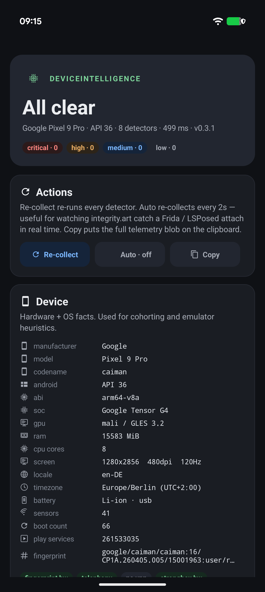
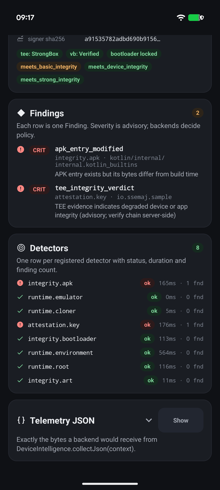
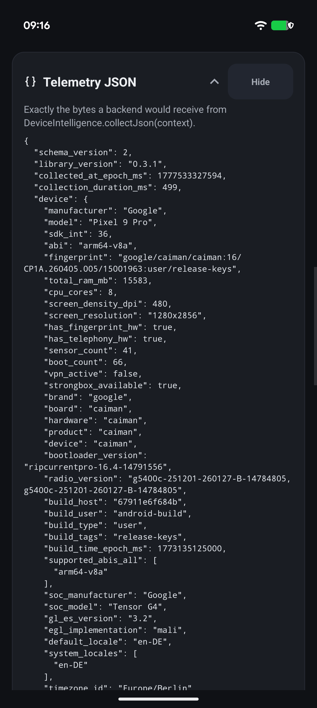
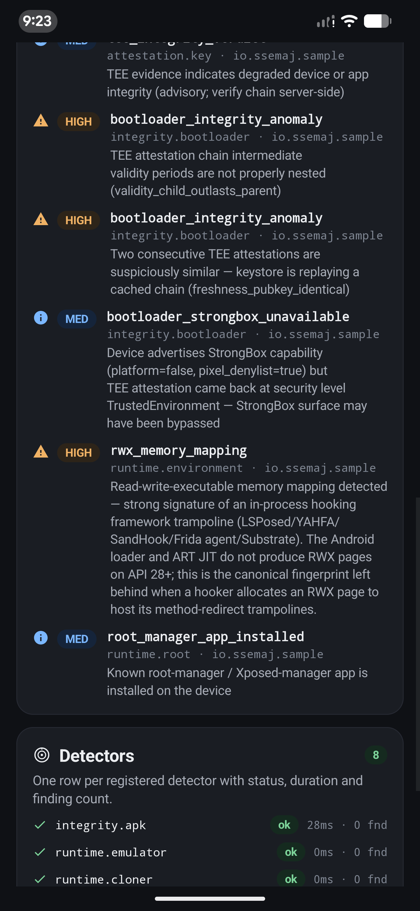

<h1 align="center">DeviceIntelligence</h1>

<p align="center">
  <strong>An open-source Android telemetry SDK for understanding the device ecosystem of your userbase.</strong><br/>
  APK integrity · hardware-backed key attestation · bootloader integrity · runtime tampering · root indicators · emulator probe · app-cloner detection.<br/>
  <em>Not a RASP. Not a kill-switch. Just structured, deterministic facts your backend can analyze.</em>
</p>

<p align="center">
  <a href="LICENSE"></a>
  <a href="https://jitpack.io/#iamjosephmj/DeviceIntelligence"></a>
  
  
  
  
  
</p>

<p align="center">
  <em>Sample app · stock Pixel 9 Pro on the left (clean release build) · the same APK with a single byte XOR'd in the middle · the raw <code>collectJson()</code> output on the right.</em>
</p>

<p align="center">
  
  
  
</p>

<p align="center">
  <em>Bonus — the same APK on a real adversarial device (Pixel 6 Pro · KernelSU + LSPosed + BootloaderSpoofer + HideMyAndroid + HideMyApplist all actively running). Six findings, including <code>rwx_memory_mapping</code> from <code>runtime.environment</code> — the universal RWX-page fingerprint that catches LSPosed, YAHFA, SandHook, Frida and Substrate without naming any of them.</em>
</p>

<p align="center">
  
</p>

---

## Install

Distributed via [JitPack](https://jitpack.io/#iamjosephmj/DeviceIntelligence).
Replace `0.3.1` with the latest tag.

**1. `settings.gradle.kts`** — declare the JitPack repo and map the plugin id
to its JitPack-published module ([why](#why-the-eachplugin-block)):

```kotlin
pluginManagement {
    repositories {
        maven("https://jitpack.io")
        gradlePluginPortal()
        google()
    }
    resolutionStrategy {
        eachPlugin {
            if (requested.id.id == "io.ssemaj.deviceintelligence") {
                useModule(
                    "com.github.iamjosephmj.DeviceIntelligence:" +
                        "deviceintelligence-gradle:${requested.version}"
                )
            }
        }
    }
}

dependencyResolutionManagement {
    repositories { google(); mavenCentral(); maven("https://jitpack.io") }
}
```

**2. `app/build.gradle.kts`** — apply the plugin. Nothing else: the plugin
auto-wires the matching runtime AAR.

```kotlin
plugins {
    id("com.android.application")
    id("org.jetbrains.kotlin.android")
    id("io.ssemaj.deviceintelligence") version "0.3.1"
}
```

**3. Collect at runtime** — call from any coroutine; the library
dispatches the work to `Dispatchers.IO` for you:

```kotlin
lifecycleScope.launch {
    val report = DeviceIntelligence.collect(context)        // typed object
    val json = DeviceIntelligence.collectJson(context)      // canonical JSON
}
```

For Java callers and synchronous boundaries (worker threads, JNI, tests),
use `DeviceIntelligence.collectBlocking(context)` / `collectJsonBlocking(context)`.

For long-running observation (e.g. watching `integrity.art` for a runtime
Frida attach), `observe()` returns a `Flow<TelemetryReport>`:

```kotlin
DeviceIntelligence
    .observe(context, interval = 2.seconds)
    .onEach { report -> render(report) }
    .launchIn(lifecycleScope)
```

The library auto-initializes via a manifest-merged `ContentProvider` and
pre-warms in the background, so the first user-visible `collect()` returns
from cached state in single-digit ms. To consume the in-flight pre-warm
instead of racing it, `awaitPrewarm(context)` returns the same report the
init provider is computing.

`kotlinx-coroutines-android` (1.9.0) is the lone runtime dependency. If your
app already uses coroutines (most modern Android apps do), Gradle dedupes —
no extra APK weight.

For VPN / biometrics-enrollment opt-ins, library-only mode (no plugin),
selective collection, and monorepo wiring, see [Advanced setup](#advanced-setup).

---

## What it is

```text
DeviceIntelligence.collect(context).toJson()
   ↓
{ schema_version, library_version, device, app, detectors[], summary }
   ↓
your backend / data warehouse  →  dashboards, cohorts, fraud signals
```

DeviceIntelligence collects structured facts about the runtime environment
of your app — APK integrity, in-process tampering, hardware-backed device
attestation, bootloader state, root indicators, emulator characteristics,
and app-cloner signals — and hands them back as a single deterministic JSON
report.

> **This is NOT a RASP.** It does not block sessions, kill processes, lock
> data, prompt the user, or interrupt any flow. It only observes. The
> intended use case is **ecosystem analysis** — *"what fraction of my MAU
> is on rooted devices?"*, *"how many sessions originate from emulators?"*,
> *"which hooking frameworks show up in my install base?"*. Your backend
> ingests the JSON, aggregates it, and surfaces the patterns. If you later
> decide to act on a signal, the policy lives in your backend — never inside
> this library. See [Why telemetry, not RASP?](#why-telemetry-not-rasp).

## Try the sample

```sh
git clone https://github.com/iamjosephmj/DeviceIntelligence.git
cd DeviceIntelligence
./gradlew :samples:minimal:installDebug
adb shell am start -n io.ssemaj.sample/.MainActivity
```

A card-based viewer that re-runs every detector on demand and lets you copy
the canonical JSON. On a clean device, every detector reports `status: "ok"`
with `findings: []`.

## What it collects

| Detector             | id                       | What it observes                                                              |
|----------------------|--------------------------|-------------------------------------------------------------------------------|
| APK integrity        | `integrity.apk`          | APK bytes vs. the build-time fingerprint baked by the Gradle plugin           |
| Bootloader integrity | `integrity.bootloader`   | Cross-checks `attestation.key`'s chain to surface TEE spoofing / cached chains |
| ART integrity        | `integrity.art`          | In-process ART tampering across 5 vectors (Frida, Xposed, LSPosed, Pine, …)   |
| Key attestation      | `attestation.key`        | TEE / StrongBox attestation: Verified Boot, bootloader lock, OS patch level   |
| Runtime environment  | `runtime.environment`    | Debugger / ptrace / hooker libs / RWX trampoline pages / `ro.debuggable` mismatch |
| Root indicators      | `runtime.root`           | `su` binary, Magisk artifacts, `test-keys`, root-manager apps                 |
| Emulator probe       | `runtime.emulator`       | CPU-instruction-level signals (arm64 MRS / x86_64 CPUID hypervisor bit)       |
| App cloner           | `runtime.cloner`         | Foreign APK mappings, mount-namespace inconsistencies, UID mismatches         |

Detector IDs are `<category>.<scope>` pairs. Each detector is independent —
adding a new one is a single line in `TelemetryCollector` and a class
implementing the internal `Detector` interface. No public-API or wire-format
changes.

The full per-detector reference (threat model, finding kinds, sample tripped
JSON, costs, caveats) lives in [**`docs/DETECTORS.md`**](docs/DETECTORS.md).

## Why telemetry, not RASP?

DeviceIntelligence is for product, security, and trust-and-safety teams that
want **visibility into the device ecosystem of their userbase** without
taking on the brittleness of an enforcement layer.

|                                  | Play Integrity      | RASP / in-app SDKs    | RootBeer-style libs | **DeviceIntelligence**         |
|----------------------------------|---------------------|-----------------------|---------------------|--------------------------------|
| Open source                      | No                  | No                    | Yes                 | **Yes (Apache 2.0)**           |
| Works without GMS                | No                  | Yes                   | Yes                 | **Yes**                        |
| Hardware-backed attestation      | Verdict only        | Sometimes             | No                  | **Yes (raw chain → backend)**  |
| Multi-layer (defense-in-depth)   | Single verdict      | Yes                   | Single signal       | **8 orthogonal detectors**     |
| Documents bypass model           | Mixed               | Rarely                | No                  | **Yes — every signal**         |
| Stable wire format               | Yes                 | Vendor-specific       | No                  | **Yes (`schema_version: 2`)**  |
| Decides on-device                | No                  | **Yes — the point**   | N/A                 | **No — the point**             |
| Designed for fleet analysis      | Per-session         | No                    | No                  | **Yes (deterministic JSON)**   |

Three reasons enforcement stays out of the library:

1. **No single signal is authoritative.** Value comes from fleet-wide
   correlation in a backend you control — not on-device "if rooted then
   crash" branches.
2. **On-device policy is the brittle part of every RASP.** An attacker with
   userland can patch out `if (tampered) System.exit()`. They can't patch
   out the JSON your backend already received.
3. **Visibility is its own product.** Knowing 3% of MAU runs rooted, that
   emulator traffic spiked 4× during a promo, or that one APK build is
   being repackaged in the wild is actionable on its own.

If you want enforcement, build it on top of the JSON DeviceIntelligence
ships you, or pair this library with a separate RASP — let each layer do
what it's good at.

## Output shape

`device.*` ships ~60 fields grouped by purpose. Every observability field is
nullable: a single failing accessor only blanks that one field, never the
surrounding report.

| Group                                                                                                                    | What backends use it for                                                                                |
|--------------------------------------------------------------------------------------------------------------------------|---------------------------------------------------------------------------------------------------------|
| **Identity** (`manufacturer`, `model`, `sdk_int`, `abi`, `fingerprint`)                                                  | Always-present basics                                                                                   |
| **Hardware identity** (`brand`, `board`, `hardware`, `bootloader_version`, `radio_version`, `build_*`, `soc_*`)          | Cohort by SoC / OEM ROM. Catches every emulator (`hardware = goldfish/ranchu`) and every custom ROM.    |
| **Resources** (`total_ram_mb`, `cpu_cores`, `screen_*`, `sensor_count`, `boot_count`)                                    | Form-factor + emulator heuristics                                                                       |
| **GPU / EGL** (`gl_es_version`, `egl_implementation`)                                                                    | Strong emulator tell — `swiftshader` / `mesa` give them away.                                           |
| **Locale + timezone** (`default_locale`, `system_locales`, `timezone_id`, `auto_time_*`)                                 | Geo-cohort without GPS. Manual clock on a "production" device usually means a fraud rig.                |
| **Display extras** (`display_refresh_rate_hz`, `display_supported_refresh_rates_hz`, `display_hdr_types`)                | Modern flagships report 120Hz + HDR10+; emulators stuck at 60Hz with no HDR.                            |
| **Security posture** (`strongbox_available`, `device_secure`, `biometrics_enrolled`†, `adb_enabled`, `developer_options_enabled`) | Bot farms / dev rigs leak here — no lockscreen, ADB on, dev options on.                          |
| **Battery + thermal** (`battery_*`, `thermal_status`)                                                                    | Emulators report `Unknown` battery tech. Click farms are always plugged in.                             |
| **Network** (`vpn_active`†)                                                                                              | Active VPN transport — opt-in.                                                                          |
| **Google ecosystem** (`play_services_*`, `play_store_version_code`, `gms_signer_sha256`)                                 | Confirms real Google-signed GMS vs. MicroG / Huawei / re-signed copies (via signer hash).               |

† Requires opt-in via the Gradle DSL — see [Permissions](#permissions).

A clean device emits empty `findings[]` everywhere and
`summary.total_findings: 0`. You can alert on `total_findings > 0`
server-side without parsing each detector individually.

<details>
<summary><b>Full clean-device report (click to expand)</b></summary>

Captured live from a clean Pixel 9 Pro running `samples/minimal`. Locale,
timezone, install timestamps, `vpn_active`, `boot_count`, and APK random
suffixes were swapped for generic values; everything else (StrongBox-backed
attestation, Tensor G4 SoC, Mali GPU, 120Hz panel, GMS signer SHA) is the
unmodified real value. For tripped-detector examples, see
[`docs/DETECTORS.md`](docs/DETECTORS.md).

```json
{
  "schema_version": 2,
  "library_version": "0.3.1",
  "collected_at_epoch_ms": 1777400000000,
  "collection_duration_ms": 8325,
  "device": {
    "manufacturer": "Google",
    "model": "Pixel 9 Pro",
    "sdk_int": 36,
    "abi": "arm64-v8a",
    "fingerprint": "google/caiman/caiman:16/CP1A.260405.005/15001963:user/release-keys",
    "total_ram_mb": 15583,
    "cpu_cores": 8,
    "screen_density_dpi": 480,
    "screen_resolution": "1280x2856",
    "has_fingerprint_hw": true,
    "has_telephony_hw": true,
    "sensor_count": 41,
    "boot_count": 142,
    "vpn_active": false,
    "strongbox_available": true,
    "brand": "google",
    "board": "caiman",
    "hardware": "caiman",
    "product": "caiman",
    "device": "caiman",
    "bootloader_version": "ripcurrentpro-16.4-14791556",
    "radio_version": "g5400c-251201-260127-B-14784805,g5400c-251201-260127-B-14784805",
    "build_host": "67911e6f684b",
    "build_user": "android-build",
    "build_type": "user",
    "build_tags": "release-keys",
    "build_time_epoch_ms": 1773135125000,
    "supported_abis_all": ["arm64-v8a"],
    "soc_manufacturer": "Google",
    "soc_model": "Tensor G4",
    "gl_es_version": "3.2",
    "egl_implementation": "mali",
    "default_locale": "en-US",
    "system_locales": ["en-US"],
    "timezone_id": "America/Los_Angeles",
    "timezone_offset_minutes": -480,
    "auto_time_enabled": true,
    "auto_time_zone_enabled": true,
    "display_refresh_rate_hz": 120.0,
    "display_supported_refresh_rates_hz": [1.0, 2.0, 5.0, 10.0, 15.0, 20.0, 24.0, 30.0, 40.0, 60.0, 120.0],
    "display_hdr_types": ["HDR10", "HLG", "HDR10_PLUS"],
    "device_secure": true,
    "biometrics_enrolled": true,
    "adb_enabled": false,
    "developer_options_enabled": false,
    "battery_present": true,
    "battery_technology": "Li-ion",
    "battery_health": "good",
    "battery_plug_type": "none",
    "thermal_status": "none",
    "boot_epoch_ms": 1776800000000,
    "play_services_availability": "success",
    "play_services_version_code": 261533035,
    "play_store_version_code": 85101930,
    "gms_signer_sha256": "5f2391277b1dbd489000467e4c2fa6af802430080457dce2f618992e9dfb5402"
  },
  "app": {
    "package_name": "io.ssemaj.sample",
    "apk_path": "/data/app/.../io.ssemaj.sample-.../base.apk",
    "installer_package": null,
    "signer_cert_sha256": ["a91535782adbd690b915679d456628153166d35527ea867ab830bccd730065a4"],
    "build_variant": "debug",
    "library_plugin_version": "0.3.1",
    "first_install_epoch_ms": 1775000000000,
    "last_update_epoch_ms": 1777300000000,
    "target_sdk_version": 36,
    "install_source": {
      "installing_package": null,
      "originating_package": null,
      "initiating_package": "com.android.shell"
    },
    "signer_cert_validity": [
      { "not_before_epoch_ms": 1771714645000, "not_after_epoch_ms": 2717794645000 }
    ],
    "attestation": {
      "chain_sha256": "dd12ccf2a857860f3712b45bcfebb7b917d4e0b9187cca0d0e50e9b119f5c9b8",
      "chain_length": 5,
      "attestation_security_level": "StrongBox",
      "keymaster_security_level": "StrongBox",
      "software_backed": false,
      "verified_boot_state": "Verified",
      "device_locked": true,
      "os_patch_level": 202604,
      "attested_package_name": "io.ssemaj.sample",
      "attested_signer_cert_sha256": ["a91535782adbd690b915679d456628153166d35527ea867ab830bccd730065a4"],
      "verdict_device_recognition": "MEETS_BASIC_INTEGRITY,MEETS_DEVICE_INTEGRITY,MEETS_STRONG_INTEGRITY",
      "verdict_app_recognition": "RECOGNIZED",
      "verdict_reason": null,
      "verdict_authoritative": false,
      "unavailable_reason": null
    }
  },
  "detectors": [
    { "id": "integrity.apk",         "status": "ok", "duration_ms": 841,  "inconclusive_reason": null, "error_message": null, "findings": [] },
    { "id": "integrity.bootloader",  "status": "ok", "duration_ms": 243,  "inconclusive_reason": null, "error_message": null, "findings": [] },
    { "id": "integrity.art",         "status": "ok", "duration_ms": 4,    "inconclusive_reason": null, "error_message": null, "findings": [] },
    { "id": "attestation.key",       "status": "ok", "duration_ms": 495,  "inconclusive_reason": null, "error_message": null, "findings": [] },
    { "id": "runtime.environment",   "status": "ok", "duration_ms": 5525, "inconclusive_reason": null, "error_message": null, "findings": [] },
    { "id": "runtime.root",          "status": "ok", "duration_ms": 458,  "inconclusive_reason": null, "error_message": null, "findings": [] },
    { "id": "runtime.emulator",      "status": "ok", "duration_ms": 0,    "inconclusive_reason": null, "error_message": null, "findings": [] },
    { "id": "runtime.cloner",        "status": "ok", "duration_ms": 0,    "inconclusive_reason": null, "error_message": null, "findings": [] }
  ],
  "summary": {
    "total_findings": 0,
    "findings_by_severity": { "low": 0, "medium": 0, "high": 0, "critical": 0 },
    "findings_by_kind": {},
    "detectors_with_findings": [],
    "detectors_inconclusive": [],
    "detectors_errored": []
  }
}
```

</details>

## Stable contract

For each `Finding` these fields are stable across releases that share the
same `schema_version` (currently `2`):

- **`kind`** — stable identifier
- **`severity`** — `low` / `medium` / `high` / `critical` (suggested; backends override per policy)
- **`subject`** — what was checked (package name, APK entry, region label)
- **`message`** — deterministic human-readable one-liner

`details` is **opaque diagnostic data**. Useful for forensics. Its keys may
change between releases without a `schema_version` bump — don't key on them
server-side.

### `status` vs `findings` — read this once

A common gotcha: a detector can report `status: "ok"` *and* still have a
non-empty `findings` array. The two fields answer different questions:

- **`status`** — "did the detector run?" → `ok` / `inconclusive` / `error`
- **`findings[]`** — "what did it see?"

So a rooted device looks like:

```json
{
  "id": "runtime.root",
  "status": "ok",
  "findings": [
    { "kind": "root_manager_app_installed", "severity": "high", ... }
  ]
}
```

`status: "ok"` means the detector ran successfully. The finding means it
caught something. Both facts are independently true.

**Why split it?** A backend has to distinguish three "no findings" cases
that look identical if you collapse them: clean device, broken on this
device (`inconclusive`), and crashed (`error`). Drive your "device looks
tampered" decision off `summary.detectors_with_findings`, not `status`.

## Detector reference

The full per-detector deep dive lives in
[**`docs/DETECTORS.md`**](docs/DETECTORS.md):

- [`integrity.apk`](docs/DETECTORS.md#integrityapk) — APK bytes vs. the build-time fingerprint
- [`integrity.bootloader`](docs/DETECTORS.md#integritybootloader) — TEE-spoofing / cached-chain detection
- [`integrity.art`](docs/DETECTORS.md#integrityart) — 5-vector deep dive (entry-point rewrites, JNIEnv hijacks, inline trampolines, `entry_point_from_jni_` overwrites, `ACC_NATIVE` flips)
- [`attestation.key`](docs/DETECTORS.md#attestationkey) — TEE / StrongBox attestation evidence + advisory verdict
- [`runtime.environment`](docs/DETECTORS.md#runtimeenvironment) — debugger / hookers / RWX pages / Zygisk fingerprint
- [`runtime.root`](docs/DETECTORS.md#runtimeroot) — `su`, Magisk, `test-keys`, root-manager apps
- [`runtime.emulator`](docs/DETECTORS.md#runtimeemulator) — arm64 MRS / x86_64 CPUID hypervisor bit
- [`runtime.cloner`](docs/DETECTORS.md#runtimecloner) — foreign APK mappings, mount-namespace inconsistencies

Two cross-cutting facts:

1. **`attestation.key`'s chain is the one authoritative signal**, but only
   after a backend re-verifies it server-side against Google's pinned
   attestation root + revocation list. Everything else — every `runtime.*`
   finding, every `integrity.*` finding, even the library's own `verdict_*`
   strings — is advisory. The chain bytes ship on the typed
   `AttestationReport.chainB64` for backend uploaders; the JSON ships only
   the compact actionable subset.
2. **`integrity.art` does not memoize across `collect()` calls.** A cached
   verdict would let any Frida / LSPosed / Zygisk attach landing *after*
   the first collect hide forever behind the frozen pre-attach result.
   Every other detector caches what it sensibly can; `integrity.art` is the
   explicit non-cached counterpart.

The [`tools/red-team/`](tools/red-team/README.md) harness ships Frida
scripts that intentionally trigger each `integrity.art` finding — useful
after any code change.

## Permissions

| Permission             | Where                                | Required by                              | Opt-in                                   |
|------------------------|--------------------------------------|------------------------------------------|------------------------------------------|
| `QUERY_ALL_PACKAGES`   | Library manifest (always merged)     | `runtime.root` `root_manager_app_installed` channel | Strip via `tools:node="remove"` |
| `ACCESS_NETWORK_STATE` | Generated fragment (opt-in)          | `DeviceContext.vpnActive`                | `enableVpnDetection.set(true)`           |
| `USE_BIOMETRIC`        | Generated fragment (opt-in)          | `DeviceContext.biometricsEnrolled`       | `enableBiometricsDetection.set(true)`    |

When you opt out, the affected field reports `null` (not `false`) so
backends can distinguish "no signal" from "negative signal".

`QUERY_ALL_PACKAGES` is a
[Play-restricted permission](https://support.google.com/googleplay/android-developer/answer/10158779)
— justify it in your Play Console submission under "anti-malware / device
security", or strip it as shown above (the rest of the library is
unaffected).

## Performance & threading

| Concern         | Behavior                                                                                                                                                                                                |
|-----------------|---------------------------------------------------------------------------------------------------------------------------------------------------------------------------------------------------------|
| Cold start      | A manifest-merged `ContentProvider` triggers `System.loadLibrary("dicore")` and a background pre-warm before `Application.onCreate`. First user-visible `collect()` returns in single-digit ms.        |
| Threading       | `suspend fun collect()` dispatches its work to `Dispatchers.IO` — call from any coroutine context including `Dispatchers.Main`. `collectBlocking()` is the synchronous Java/legacy variant; do NOT call it from `Dispatchers.Main`. The library owns its own internal scope for the init pre-warm. |
| `collect()`     | ~tens of ms on a warm process; cancellable between detectors (a cancelled coroutine resumes with `CancellationException` after the currently-running detector finishes).                                |
| `observe()`     | `Flow<TelemetryReport>` that emits on `Dispatchers.IO` every `interval` (default 2 s) until the collecting scope is cancelled. Pair with `CollectOptions(only = setOf("integrity.art"))` for cheap hot-loop polling. |
| `awaitPrewarm()`| Returns the in-flight init pre-warm if one is being computed, otherwise runs a fresh `collect()`. Use it on splash screens to avoid a redundant collect.                                                |
| Caching         | Most detectors cache for the process lifetime (attestation chain, `/proc/self/maps`, `/proc/mounts`, root-manager lookup). **`integrity.art` re-runs on every call** by design — see above.             |
| Native lib size | `libdicore.so` ~230–250 KB stripped per ABI (release, `arm64-v8a` + `x86_64` only), built with `-fvisibility=hidden`, `-ffunction-sections`, `--gc-sections`.                                           |

## Building from source

```sh
# Tests + sample APK
./gradlew :deviceintelligence:test :samples:minimal:assembleDebug

# Library AAR (release)
./gradlew :deviceintelligence:assembleRelease
# → deviceintelligence/build/outputs/aar/deviceintelligence-release.aar

# Gradle plugin (sibling project; not composite-included in root settings)
./gradlew -p deviceintelligence-gradle build

# Publish both halves to local Maven (mirrors what JitPack does on tag)
./gradlew :deviceintelligence:publishToMavenLocal
./gradlew -p deviceintelligence-gradle publishToMavenLocal
```

Requirements: JDK 17 (Android Studio's bundled JBR works fine), Android SDK
`platforms;android-36` + `build-tools;36.0.0`, Android NDK `27.0.12077973`.
Maven Central is not wired yet — follow
[issues](https://github.com/iamjosephmj/DeviceIntelligence/issues) for
updates.

## Project layout

```
deviceintelligence/         ← runtime AAR (Kotlin + JNI native lib libdicore.so)
deviceintelligence-gradle/  ← build-time plugin (sibling project)
samples/minimal/            ← sample app: programmatic Kotlin UI (no XML, no Compose)
tools/                      ← APK build / instrumentation helper scripts
dist/                       ← demo APKs the build scripts produce
jitpack.yml                 ← JitPack build config (SDK + NDK install + publish)
```

The runtime SDK has roughly two layers: **Kotlin orchestration** (public API,
the `Detector` plugin contract, `TelemetryCollector`, hand-rolled JSON
serializer with zero third-party deps), and **native probes** (C++17 doing
the things the JVM either can't or can't do efficiently — raw syscalls for
the cloner probe, arm64 MRS / x86_64 CPUID for the emulator probe, APK
ZIP / signing-block parse, `/proc/self/maps` read).

## Advanced setup

### Opt-in detectors

```kotlin
deviceintelligence {
    verbose.set(true)
    enableVpnDetection.set(true)         // injects ACCESS_NETWORK_STATE
    enableBiometricsDetection.set(true)  // injects USE_BIOMETRIC
}
```

### Library-only mode (no plugin)

If you want the runtime AAR without the Gradle plugin's build-time work —
for example, you want to **skip `integrity.apk` entirely** — drop the
plugin and pull the AAR directly:

```kotlin
// settings.gradle.kts: just the JitPack repo, no eachPlugin block needed
dependencyResolutionManagement {
    repositories { google(); mavenCentral(); maven("https://jitpack.io") }
}

// app/build.gradle.kts
dependencies {
    implementation("com.github.iamjosephmj.DeviceIntelligence:deviceintelligence:0.3.1")
}
```

Without the plugin, the `integrity.apk` fingerprint asset is absent at
runtime, so the APK-integrity detector reports `status: "inconclusive"`
with `inconclusive_reason: "asset_missing"`. Every other detector works
unchanged.

### Monorepo / vendor fork

If your root `settings.gradle.kts` `include`s `:deviceintelligence`, the
plugin substitutes `project(":deviceintelligence")` for the JitPack
coordinate so local Kotlin / native changes are picked up without
publishing. This is what [`samples/minimal`](samples/minimal/build.gradle.kts)
relies on.

To force the **published** AAR anyway (e.g. AAR delivered via a wrapper
module the plugin can't see), set `disableAutoRuntimeDependency = true` in
the DSL — or pass `-Pdeviceintelligence.disableAutoRuntimeDependency=true`
on the command line — and add the `implementation(...)` line yourself,
locked to the same version as the plugin.

### What the Gradle plugin does at build time

Per variant:

1. Computes a SHA-256 fingerprint over your APK's entries.
2. Encrypts the fingerprint blob with a per-build XOR key whose chunks are
   split across generated Kotlin classes — a *cost amplifier* (not
   encryption) that defeats `unzip + grep` and naive blob substitution.
3. Injects the encrypted blob as `assets/io.ssemaj/fingerprint.bin` and
   re-signs the APK with your `signingConfig` (v1+v2+v3).
4. Generates a manifest fragment with whatever opt-in permissions you
   enabled and wires it into the variant via `addGeneratedManifestFile`.
5. Adds the matching runtime AAR coordinate to your `implementation`
   configuration — same group, same version as the plugin itself, so the
   runtime classes that read the build-time fingerprint are always at the
   exact wire-schema version the plugin emitted them under.

### Why the `eachPlugin` block

Gradle resolves a plugin id (`io.ssemaj.deviceintelligence`) by looking for
its plugin-marker artifact at `<group>:<id>:<version>`. The
[standard JitPack-Gradle-plugin pattern](https://docs.jitpack.io/building/#gradle-plugins)
is to redirect that lookup to the actual published coordinate
(`com.github.iamjosephmj.DeviceIntelligence:deviceintelligence-gradle:<version>`).
Five lines, one-time setup.

## Contributing

Issues, PRs, and ideas for new detectors welcome. A few principles:

1. **Telemetry, not RASP.** Anything that reaches into `System.exit`,
   `Process.killProcess`, "wipe encrypted data", or "lock the user out"
   territory belongs in the consumer's policy layer, not here. PRs that
   add on-device enforcement will be declined on principle.
2. **Document the bypass model.** Every detector explains *exactly* how
   that signal can be defeated. Be honest. A "perfect" detector wouldn't
   survive the next minor Android release; what you want is a layer that's
   *expensive enough to bypass* relative to its cost to maintain.
3. **No throwing.** Detectors wrap failures and return
   `DetectorStatus.ERROR`. A throw breaks `collect()` for the consumer.
4. **Wire format = stable contract.** Adding fields to `Finding.details` is
   fine without a schema bump. Renaming or removing anything stable
   (`kind`, `severity`, `subject`, `message`, the field names under
   `device` / `app` / `summary`) requires bumping `schema_version`.
5. **Keep it small.** Native lib is ~230–250 KB stripped per ABI; new
   native code should justify its bytes. The pure-Kotlin orchestrator has
   exactly one runtime dependency (`kotlinx-coroutines-android`) — adding
   a second needs a strong justification.

For non-trivial changes, please open an issue first so we can talk through
the design.

### Reporting a security issue

If you think you've found a security-relevant bug (a way to make a detector
miss something, crash the host app, or exfiltrate data the library
shouldn't be exposing), please **do not file a public issue**. Email the
maintainer at the address listed on the GitHub profile, or open a private
[security advisory](https://github.com/iamjosephmj/DeviceIntelligence/security/advisories).

## Prior art and acknowledgments

- [Google's Android Key Attestation sample](https://github.com/google/android-key-attestation) — reference for parsing the `KeyDescription` extension.
- [AOSP Verified Boot docs](https://source.android.com/docs/security/features/verifiedboot) — semantics of `verified_boot_state` and the bootloader-lock signals.
- [Tricky Store](https://github.com/5ec1cff/TrickyStore) and the broader LSPosed / Magisk research community — the bypass model `integrity.bootloader` is built around.
- [RootBeer](https://github.com/scottyab/rootbeer), [SafetyNetSamples](https://github.com/googlesamples/android-play-safetynet) — prior art for `runtime.root`.
- [Frida](https://frida.re/), [LSPosed](https://github.com/LSPosed/LSPosed) — the canonical hooking-framework signatures `runtime.environment` watches for.

If your project is a direct inspiration and isn't credited, please open a PR.

## License

Apache 2.0 — see the [`LICENSE`](LICENSE) file for the full text.

```
Copyright 2026 Joseph James (iamjosephmj)

Licensed under the Apache License, Version 2.0 (the "License");
you may not use this file except in compliance with the License.
You may obtain a copy of the License at

    http://www.apache.org/licenses/LICENSE-2.0
```
